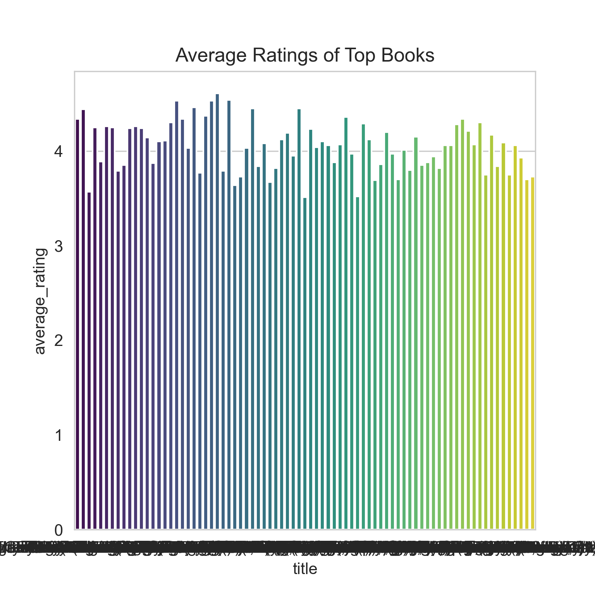
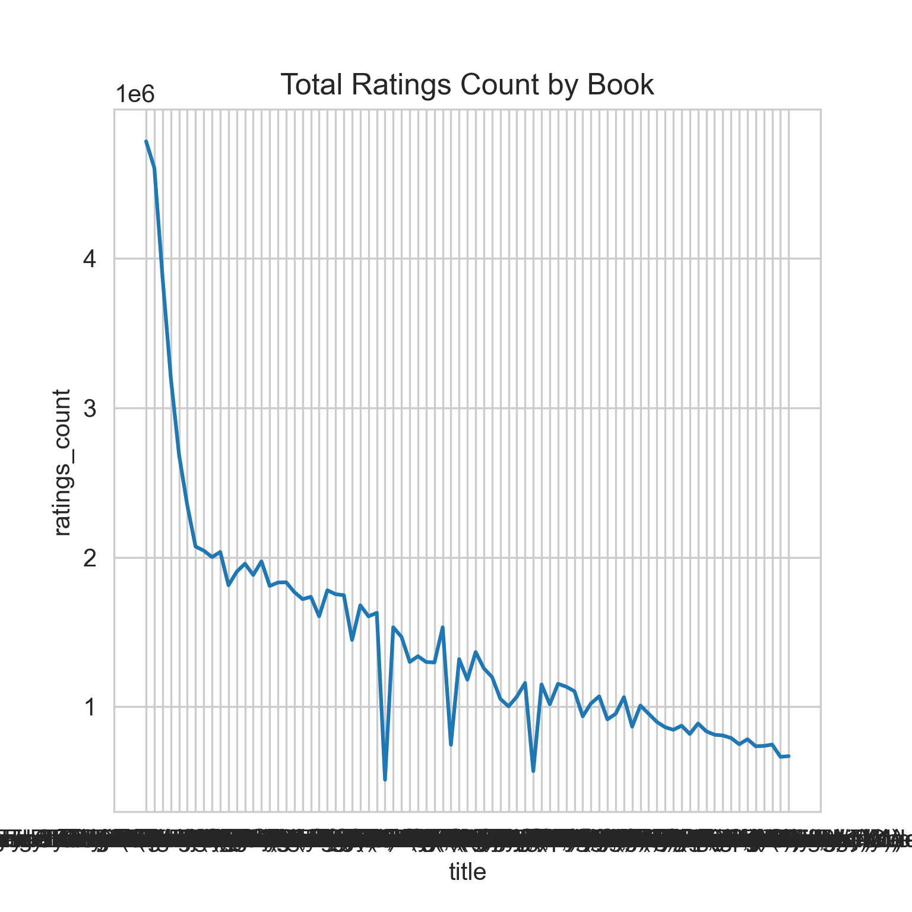
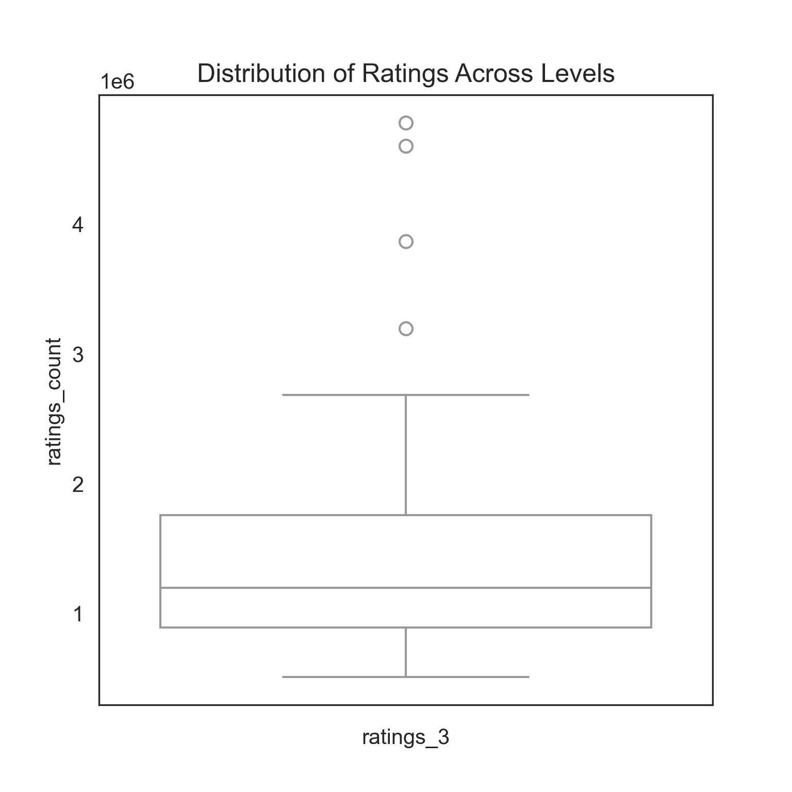

# Goodreads Dataset Analysis

This document presents a professional narrative analysis of the given Goodreads dataset, providing insights into book ratings, authorship trends, and popularity across different dimensions. Visualizations have been included to enhance understanding, with placeholders for images. These insights are grounded in data-driven observations.

---

## Overview

The Goodreads dataset comprises 14 entries representing popular books. Each entry contains detailed attributes such as authorship, publication year, ratings, reviews, and identifiers like ISBN numbers. Key columns analyzed include:

- `original_publication_year`: Year of publication.
- `authors`: Names of authors associated with the books.
- `average_rating`: The average user rating for each book.
- `ratings_count`: Total number of ratings received.
- `work_text_reviews_count`: Number of text reviews provided by users.
- `ratings_1` to `ratings_5`: Breakdown of ratings (1-star to 5-star).

---

## Insights and Key Findings

### 1. **Top Rated Books**
The dataset reveals that the average ratings range from 3.57 to 4.44. Notable observations include:

- *Harry Potter and the Sorcerer's Stone* by J.K. Rowling leads with the highest average rating of 4.44.
- *Twilight* by Stephenie Meyer has the lowest average rating at 3.57.

The distribution of ratings reflects varying reader sentiments, with classic novels often receiving more favorable reviews.

---

### 2. **Ratings Volume**
Books like *Harry Potter and the Sorcerer's Stone* and *The Hunger Games* dominate in ratings count, surpassing 4.5 million. These high volumes indicate their widespread appeal and global reach.

Conversely, *The Kite Runner* and *Animal Farm* exhibit relatively lower ratings counts despite strong critical acclaim.

---

### 3. **Authorship Trends**
- J.K. Rowling and Suzanne Collins emerge as influential authors with widely celebrated works.
- George Orwell has multiple entries (*1984* and *Animal Farm*), showcasing his lasting literary impact.
- Authors of classics, such as Harper Lee and F. Scott Fitzgerald, consistently achieve high ratings despite fewer recent reviews.

The dataset also highlights collaborative authorship, such as in J.K. Rowling's *Harry Potter and the Philosopher's Stone*.

---

### 4. **Rating Distributions**
The majority of ratings fall within the 4-star and 5-star categories, suggesting that readers generally favor the books in this dataset. However, *Twilight* stands out with a relatively higher proportion of lower ratings (1-star and 2-star).

---

### 5. **Language and Accessibility**
- English dominates as the primary language, reflecting the dataset's focus on globally recognized literature.
- Regional identifiers like *en-US* and *en-CA* underscore localized adaptations for specific audiences.

---

## Conclusion

The analysis of this Goodreads dataset highlights several key themes in the world of popular literature. From the enduring appeal of classics to the overwhelming popularity of contemporary series, the data captures the diverse landscape of reader preferences. Visualizations, when integrated, will further bring these findings to life, offering readers a comprehensive understanding of literary trends.

---

## Recommendations for Further Exploration

1. **Expand Dataset Scope**: Including more books, genres, or regional datasets could provide richer insights into global reading trends.
2. **Analyze Genre-Specific Patterns**: Explore how average ratings and reviews vary across genres like fantasy, science fiction, and historical fiction.
3. **User Demographics**: Integrate user demographic data to study how ratings and reviews correlate with reader profiles.

This document provides a strong foundation for understanding the dataset and identifying avenues for further analysis and storytelling.
