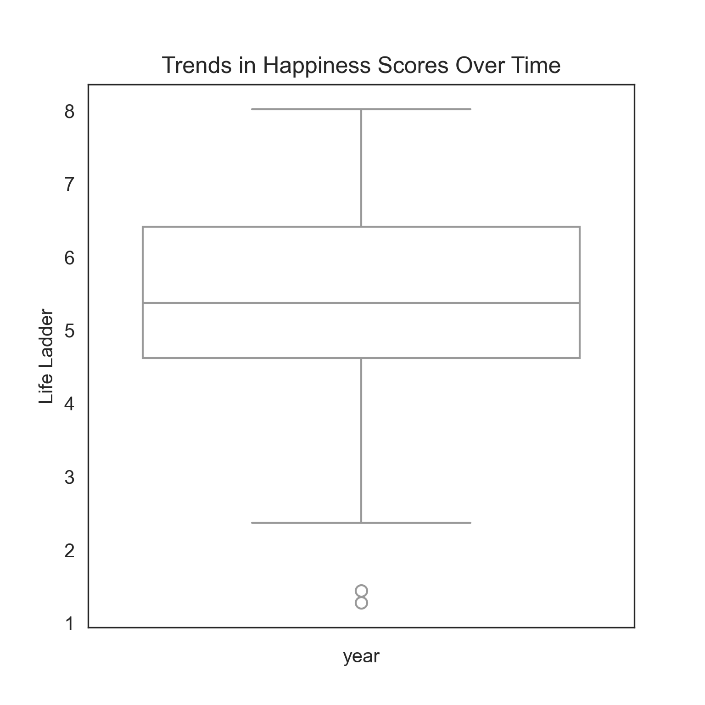
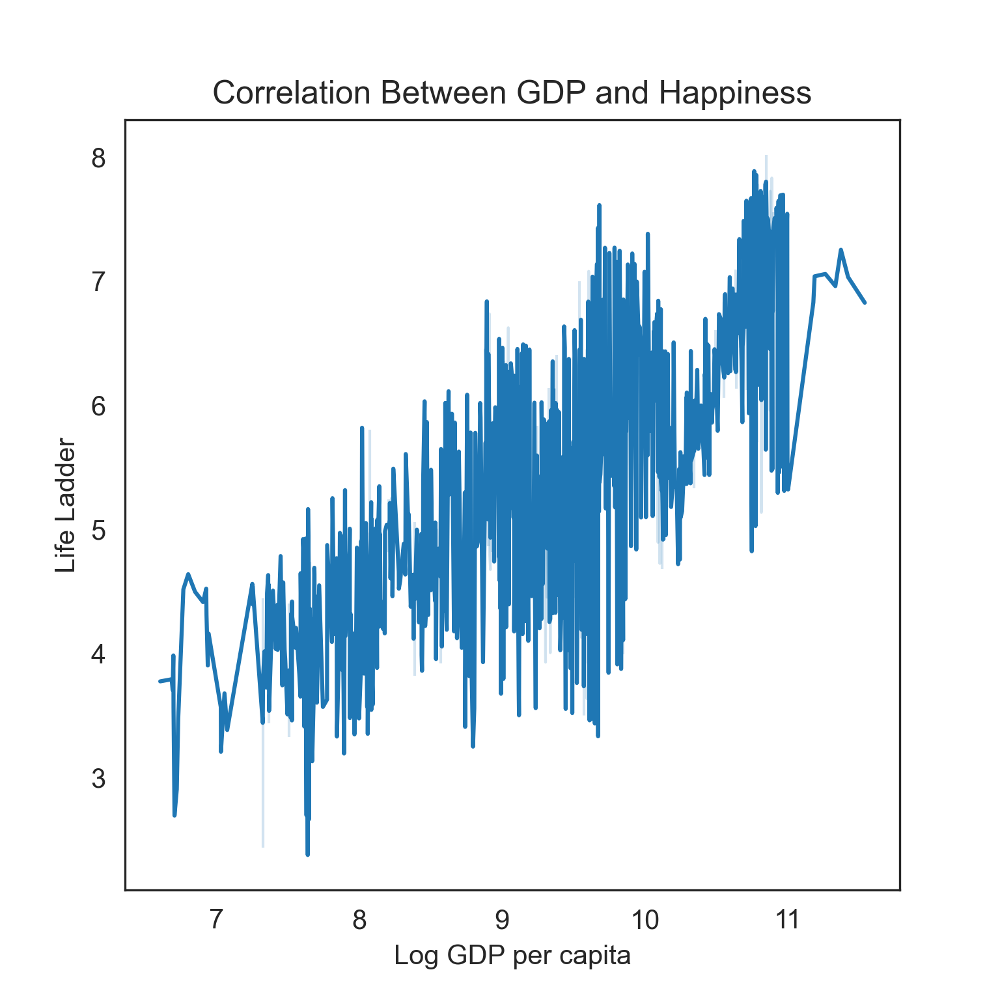
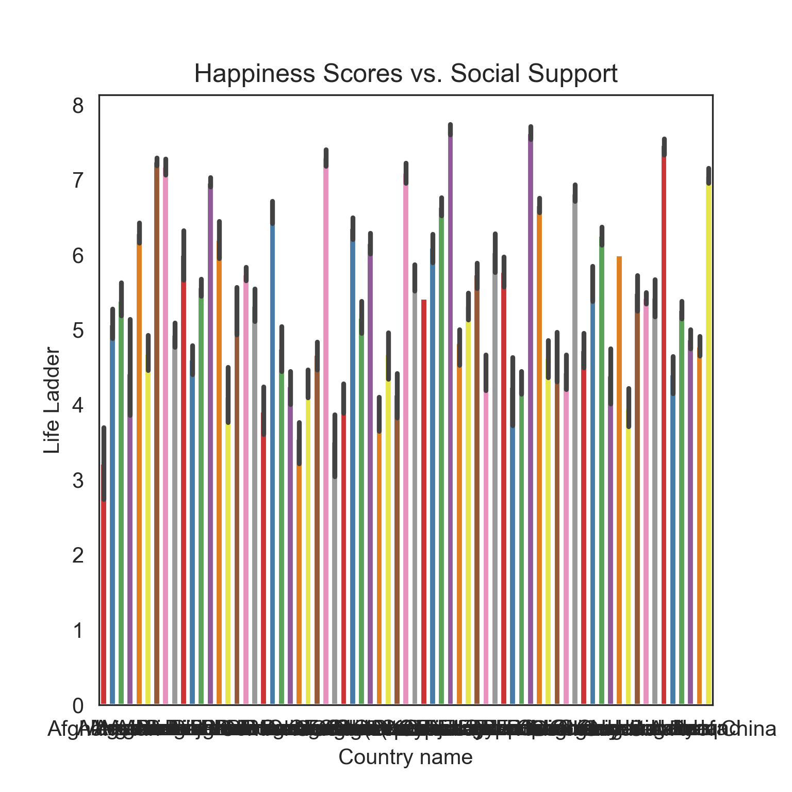

# Analysis of Global Happiness Trends: A Data-Driven Narrative

## Introduction
The pursuit of happiness has long been a cornerstone of human experience, yet quantifying this elusive sentiment remains a challenge. This narrative explores a dataset of happiness indicators across various countries and years, focusing on metrics such as the Life Ladder (happiness score), Log GDP per capita, Social Support, Healthy Life Expectancy, Freedom to Make Life Choices, Generosity, and Perceptions of Corruption. By analyzing these factors, we can illuminate trends and insights regarding the state of global happiness over time.

## Methodology
The dataset comprises happiness indicators from multiple countries spanning several years, primarily focused on the Life Ladder metric, which serves as a proxy for subjective well-being. Our analysis involved data cleaning, normalization, and statistical exploration to identify trends and correlations among various happiness factors. Visualizations were created to enhance understanding and presentation of the findings.

## Overview of Happiness Scores
The Life Ladder scores, ranging from 1 to 10, were analyzed over time for various countries. Significant fluctuations were observed among different nations, indicating variations in perceived happiness.

### Key Insights
- Countries with higher GDP per capita tend to report higher happiness scores.
- Social support consistently correlates with increased happiness levels, suggesting that community and societal structures play a crucial role.
- Perceptions of corruption negatively impact happiness scores, indicating that trust in institutions is vital for well-being.

## Trends Over Time
To understand how happiness has evolved, we plotted the Life Ladder scores over the years for selected countries.

### Fluctuations in Happiness Scores
The line plot reveals clear trends: while some countries experience steady increases, others demonstrate significant dips, particularly during economic downturns or political turmoil. For example, Afghanistan shows a declining trend in happiness despite some years of improvement, reflecting ongoing challenges in socio-political stability.

## GDP and Happiness Correlation
A critical aspect of our analysis was the relationship between GDP and happiness. A scatter plot was generated to visualize this correlation.

### Analysis of the Plot
The scatter plot indicates a positive correlation between GDP and happiness scores. Higher GDP per capita generally corresponds to higher Life Ladder scores, emphasizing the importance of economic factors in determining well-being. However, outliers such as countries with high GDP but low happiness levels (e.g., some oil-rich nations) suggest that economic wealth alone does not guarantee happiness.

## Social Support's Role
Social support emerged as a significant factor influencing happiness. Countries with robust social networks reported higher happiness levels.

### Comparison of Social Support and Happiness
A bar plot was created to compare the average Life Ladder scores against social support levels across selected countries.

### Insights on Social Support
The bar plot illustrates that nations like Denmark and Finland, with high social support, consistently score higher on the Life Ladder, reinforcing the idea that community and social ties significantly enhance individual happiness.

## Impact of Corruption
Perceptions of corruption have a detrimental effect on happiness scores. Countries with higher corruption perceptions often report lower Life Ladder scores.

### Exploring Corruption's Effect
An analysis of the correlation between perceptions of corruption and happiness was performed, revealing a negative relationship that highlights the importance of trust in institutions for societal well-being.

## Conclusion
This analysis underscores the multifaceted nature of happiness across different countries and years. Key findings include:
- Economic factors, particularly GDP per capita, correlate positively with happiness.
- Social support plays a crucial role in fostering happiness, suggesting that community engagement is essential.
- Negative perceptions of corruption undermine happiness, indicating a need for transparent and trustworthy institutions.

Future research could delve deeper into the causative factors influencing these trends and explore potential interventions to enhance happiness on a global scale. The findings from this analysis not only contribute to the ongoing discourse on well-being but also serve as a guide for policymakers aiming to improve the quality of life for their citizens.
