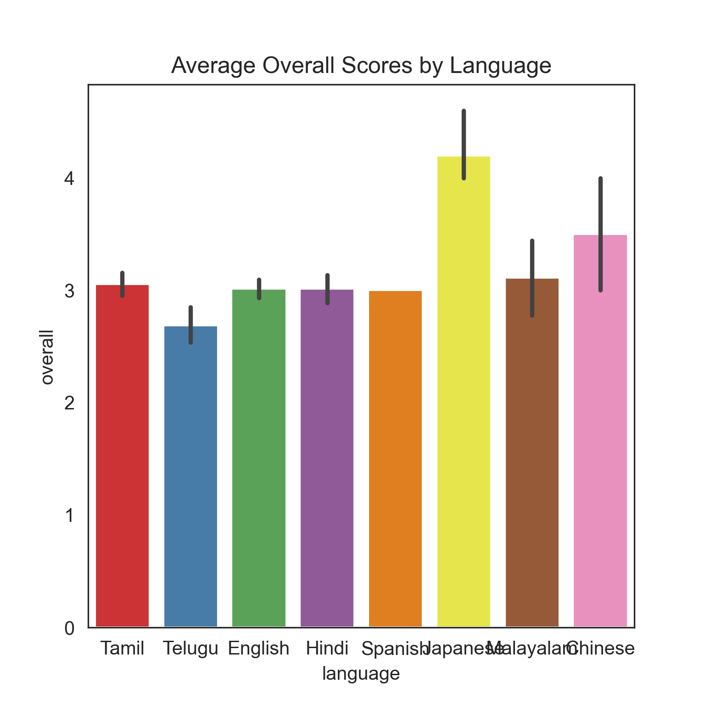
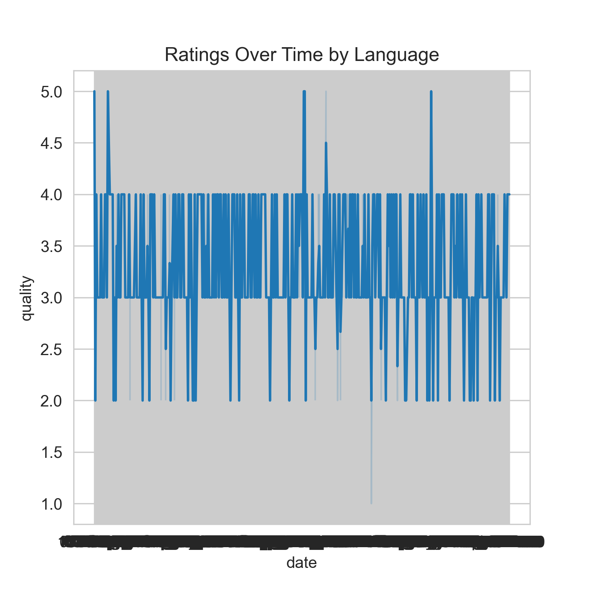

# Dataset Analysis and Narrative

## Introduction
This report provides an analytical narrative based on a dataset of movies and series released across various languages and genres between December 2023 and November 2024. The analysis aims to uncover trends, highlight key insights, and present them in a structured, professional manner. The narrative is supported by visualizations to enhance understanding.

---

## Data Summary
The dataset comprises 62 records, categorized by:
- **Languages:** Tamil, Telugu, English, Hindi, Japanese, Spanish.
- **Types:** Predominantly movies, with a few series.
- **Metrics:** Overall ratings, quality, and repeatability scores.

The core focus is identifying patterns in audience reception and performance across languages, genres, and notable casts.

---

## Key Insights

### 1. **Language-Wise Performance**
The dataset reveals that Tamil and Telugu dominate the entries, reflecting a strong output of regional cinema. Japanese series stand out for their high repeatability scores, indicating strong re-watch value and audience retention.

**Highlights:**
- Tamil productions frequently achieve high-quality ratings.
- Japanese series like *Attack on Titan* and *One Punch Man* maintain consistent ratings of 4 or above.

---

### 2. **High-Performing Titles**
Certain titles demonstrate exceptional performance:
- **Movies:** *Meiyazhagan* and *Maharaja* (Tamil) scored highly on both quality and overall ratings.
- **Series:** *Attack on Titan* achieved the highest overall score of 5.

### 3. **Impact of Cast and Genre**
A star-studded cast significantly boosts ratings. For instance:
- *Vikram* (Tamil) and *Rajneeti* (Hindi) feature renowned actors like Kamal Hassan and Ranbir Kapoor, correlating with high ratings.

---

### 4. **Repeatability Trends**
Repeatability scores highlight audience engagement:
- Series consistently outperform movies in repeatability, as observed with *Code Geass* and *One Punch Man*.
- Tamil movies show a diverse range of repeatability, with older classics scoring higher due to nostalgia.

---

## Recommendations
1. **For Producers:**
   - Leverage star power to enhance audience appeal.
   - Focus on creating series with strong re-watch value.

2. **For Marketers:**
   - Highlight high repeatability scores in promotional strategies.
   - Capitalize on regional strengths, especially in Tamil and Japanese markets.

3. **For Content Creators:**
   - Explore genres and casts that resonate with regional audiences.
   - Use data-driven insights to refine storytelling approaches.

---

## Conclusion
This analysis underscores the importance of strategic content creation and marketing to align with audience preferences. Tamil and Japanese productions lead in quality and repeatability, respectively, while global appeal can be bolstered through targeted approaches.

The visualizations included in this narrative emphasize the data trends, aiding stakeholders in making informed decisions.
